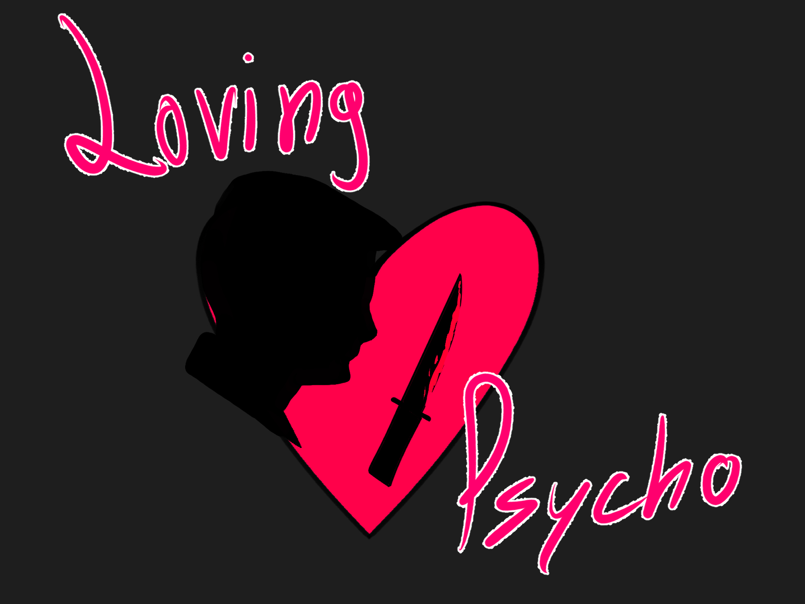
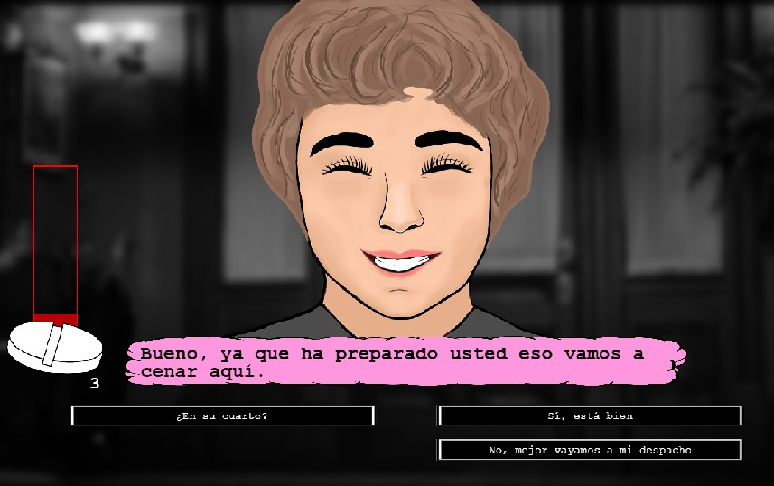
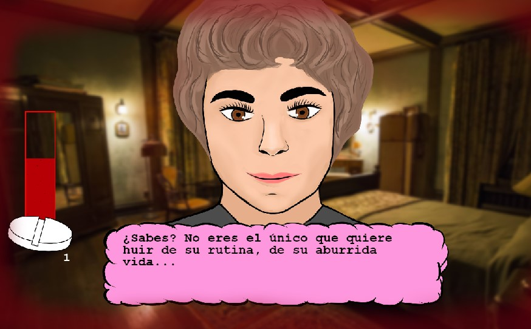
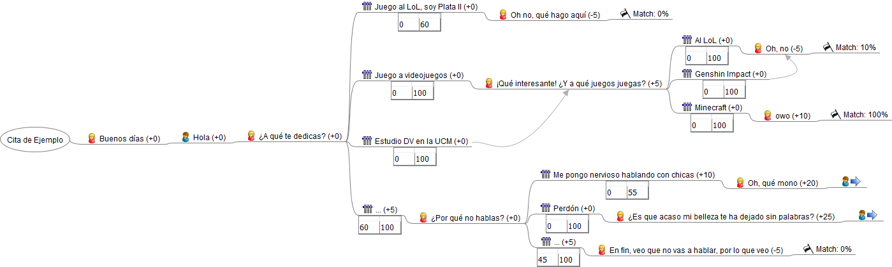
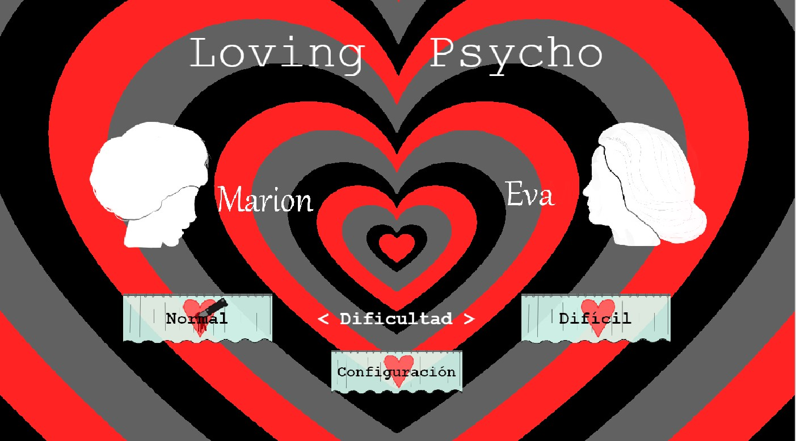
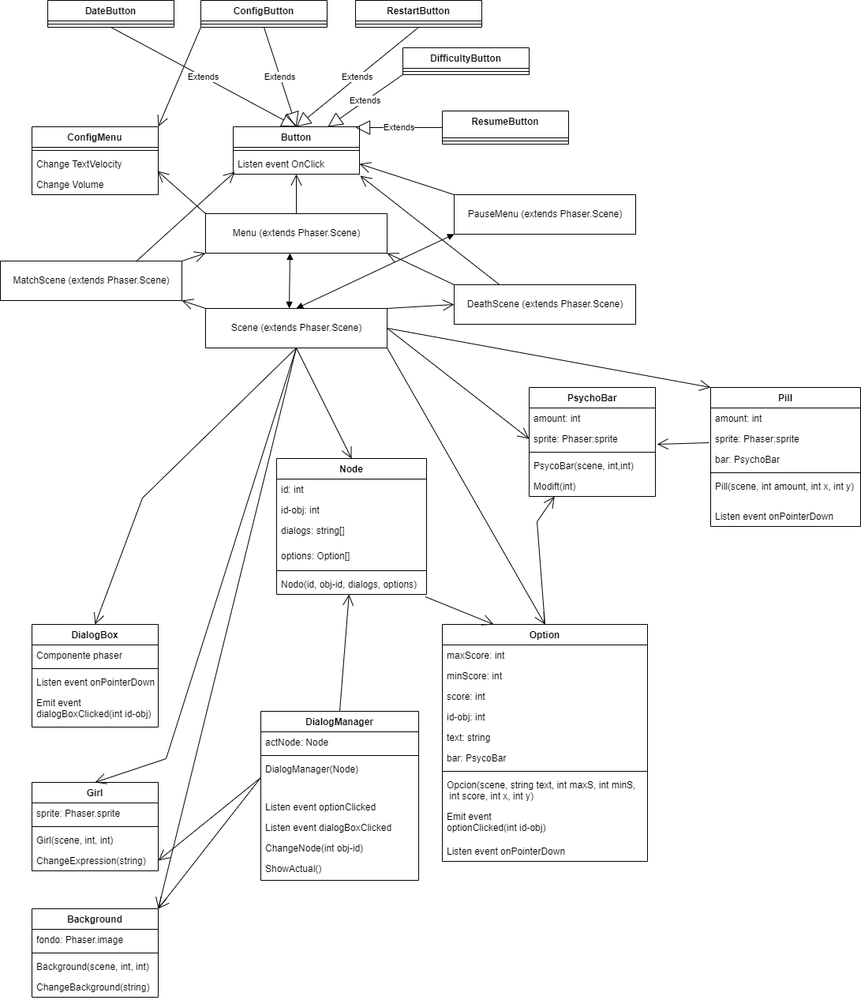

# LOVING PSYCHO
[Página de gestión (Pivotal Tracker)](https://www.pivotaltracker.com/n/projects/2532848)
[Página web del juego](https://jgomez18ucm.github.io/Loving_Psycho/)

*Documento de diseño de videojuego*  

**Nombre de la empresa: "3! - 1"**  

*Integrantes:*

*José María Gómez Pulido*  
*Sergio Baña Marchante*     
*Víctor Estremera Herranz*    
*Eduardo de Orellana*

*E-mail de contacto:*   
*lovingpsycho.pvli@gmail.com*   

*Versión 1.1 – 8 de Octubre de 2021* 

<table>
  <tr>
    <td colspan = "2"> Resumen </td>
  </tr>
  <tr>
    <td> Generos: Dating simulator, horror game, novela visual </td>
    <td> Modos: single-player, dos dificultades</td>
  </tr>
  <tr>
    <td> Publico objetivo:  
         Edad: +16  
         Sexo: indiferente  
         Idioma: español    
    </td>
    <td> Plataformas: web</td>
  </tr>
  <tr>
    <td> Cantidades:  
         Objetos: 1  
         Personajes: 3  
   </td>
    <td> Hitos:  
         Fecha de propuesta del concepto:  
         24 de septiembre de 2021  
         Fechas de pre-producción:  
         Hito 0 : 1 de octubre de 2021  
         Hito 1 : 29 de octubre de 2021  
         Fechas de producción  
         Fecha de lanzamiento  
   </td>
  </tr>
</table>

-------------------------------------------

## Descripción

Loving Psycho es un dating simulator con un pequeño toque de terror. En él, el jugador encarna a Norman Bates, personaje de "Psicosis" que sufre de una doble personalidad. El jugador tendrá que ligar con su cita mientras intenta mantener a raya a su doble personalidad (su madre). Si lo consigue, el jugador llegará al final de su cita, consiguiendo así un determinado nivel de match. En caso de que el jugador no matenga a raya su enfermedad, matará a su cita y esta terminará de forma prematura.
Logotipo y portada del juego |
-----------------------------|
|

-------------------------------------------

## Tabla de contenidos

1. [Aspectos Generales](#aspectos-generales)  
    1.1 [Relato breve y parcial de una partida típica](#relato-breve)  
  
2. [Jugabilidad](#Jugabilidad)  
    2.1 [Mecánica](#Mecánica)   
         - [Controles](#Controles)  
         - [Cámara](#Cámara)  
    2.2 [Dinámica](#Dinámica)  
    2.3 [Estética](#Estética)  

3. [Menús y modos de juegos](#Menús_y_modos_de_juegos)  
    3.1 [Configuración](#Configuración)  
    3.2 [Interfaz y control](#Interfaz_y_control)  

4. [Contenido](#Contenido)  
    4.1 [Historia](#Historia)  
    4.2 [Niveles](#Niveles)  
    4.3 [Personajes y enemigos](#Personajes_y_enemigos)  
    4.4 [Objetos](#Objetos)  

5. [Referencias](#Referencias) 

6. [Diagrama UML](#uml)

--------------------------------------------

## <a name = "aspectos-generales">1. Aspectos Generales</a>

Vista general |
-|

|
### <a name = "relato-breve">1.1 Relato breve y parcial de una partida tipica</a>

El jugador elegirá una de dos citas disponibles. A medida que el jugador avanza en la conversación, este elige las distintas opciones de diálogo que cree más convenientes para, al mismo tiempo, agradar a su cita y evadir el instinto asesino en forma de madre que duerme en su interior. Durante la cita el jugador también podrá hacer uso de sus pastillas para reducir su barra de instinto asesino. Al final de la cita el jugador obtendrá un porcentaje de "Match" dependiendo de lo bien o mal que lo haya hecho.

------------------------------------

## <a name = "Jugabilidad">2. Jugabilidad</a>
El objetivo del juego es elegir las opciones de diálogo más convenientes en cada momento para consguir el máximo porcentaje de "Match" con nuestra cita, al mismo tiempo que controlamos la barra de instinto asesino para evitar matarla.

### <a name = "Mecánica">2.1 Mecánica</a>
La mecánica principal del juego es controlar la barra de instinto asesino (0 - 100). Si la barra llega al máximo la conversación acabará y tu instinto asesino en forma de madre matará a tu cita (perdiendo así la partida). La barra podrá subir y bajar con las distintas opciones de diálogo:
a medida que avance la cita el jugador tendrá que elegir entre diferentes opciones de diálogo, algunas de ellas aumentarán tu
barra de instinto asesino, otras dejarán la barra prácticamente intacta y otras la reducirán. Así mismo, cuando el jugador tenga 
que elegir entre varias opciones de diálogo la barra de instinto asesino aumentará poco a poco hasta que el jugador se decida por
una de las respuestas (solo en modo difícil). Dependiendo de tu nivel de instinto asesino podrás elegir unas opciones de diálogo u otras, de esta forma, si el jugador deja pasar el tiempo haciendo que la barra de instnto asesino suba gradualmente, podrá ocurrir que despareciesen algunas opciones de diálogo al mismo tiempo que otras apareciesen. El número de opciones de diálogo será de un mínimo de 2 y un máximo de 4. No en todos los diálogos el jugador tendrá que elegir entre varias opciones, muchos de estos serán lineales. Los diálogos lineales, tanto de tu cita, como los tuyos, también podrán modificar la barra de instinto asesino (tenidendo en cuenta que estos diálogos lineales dependen de las opciones elegidas anteriormente). Durante estos diálogos la barra de instinto asesino no subirá progresivamente si tardas en pasar de un diálogo a otro. 

El jugador podrá hacer uso de sus pastillas durante cualquier momento de la cita. El jugador dispondrá de tres pastillas. Si el jugador toma un pastilla su barra de instinto bajará la mitad de la que tenga en ese momento.

La lógica del juego se basará en un gran árbol de diálogo en el que habrá unos nodos que apuntarán a un solo nodo (diálogos lineales) y nodos que apuntarán a varios, los cuales corresponderá a los momentos en los que el jugador tenga que elegir entre varias opciones de diálogo, dividiéndose así el árbol en más ramas. El juego terminará cuando el jugador llegue a una rama cortada. Cada rama cortada corresponderá a un final distinto, en el que el jugador podrá ver lo bien o mal que lo ha hecho en su cita dependiendo de un porcentaje de "Match" (cada final viene asociado con un nivel de "Match" de forma predefinida). La cita también puede acabar prematuramente si la barra de instinto asesino llega al máximo, como ya se ha explicado anteriormente.

#### <a name = "Controles">2.1.1 Controles </a>
El juego se controla principalmente con el ratón, haciendo click en las diferentes opciones de diálogo o en el botón de tomarse las pastillas. Adicionalmente, para tomarse las pastillas se podrá pulsar la barra espaciadora.

#### <a name = "Cámara">2.1.2 Cámara </a>
La cámara será estática, mostrando el escenario. Además, el retrato de la persona con la que estás hablando aparecerá en el centro de la pantalla.

### <a name = "Dinámica">2.2 Dinámica</a>
El objetivo del juego es conseguir triunfar en tu cita, para ello el jugador tendrá que valorar qué respuesta le conviene más en cada momento teniendo en cuenta que, cuanto más sugerentes sean tus conversaciones con tu cita, más mosqueada estará tu madre y por lo tanto, más subirá tu barra de instinto asesino. 

De esta forma se pueden idean estrategias muy variadas. Si tu barra de instinto asesino se encuentra baja tendrás más banda ancha para hablar con tu cita, mientras que si tu barra se encuentra alta deberás medir más tus palabras. También puedes arriesgarte elegir opciones que sabes que no le van a gustar a tu madre para posteriormente tomarte uno de tus pastillas. Así mismo, si has llegado a un punto en el que tu barra de instinto asesino está muy alta y ya se te hace muy difícil remediarlo debido a que las opcines de diálogo favorables ni siquiera aparecen, lo mejor será que intentes asustar a tu cita antes que matarla.

### <a name = "Estética">2.3 Estética</a>
Cada una de las citas deberá tener una serie de expresiones que cambiarán dependiendo del diálogo: neutral, feliz, riéndose, aburrida, asustada, enfadada...

Cuanto más alta esté la barra de instinto asesino, más difuminados y rojos se pondrán los bordes (simulando sangre), dándole al gameplay un ambiente opresivo de inestabilidad.

Durante las citas sonará música de jazz, pero la música se reproducirá más lenta dependiendo lo alta que esté tu barra de instinto asesino.

El lugar de las citas podrá cambiar durante el transcurso de estas.

------------------------------------

## <a name = "Menús_y_modos_de_juegos">3. Menús y modos de juego</a> 
Loving Psycho es un juego para un solo jugador, que cuenta con dos dificultades:  
  -Normal: la barra de instinto asesino solo puede subir con los distintos diálogos.   
  -Difícil: en los momentos en los que el jugador tenga que elegir entre varias opciones de diálogo, pasado un pequeño tiempo (4 segundos), la barra de instinto asesino subirá progresivamente como castigo por no ser rápido con las respuestas.

### <a name = "Configuración">3.1 Configuración</a>

El menú de configuración se abrirá con el Esc. Contará con la opción de regular la velocidad a la que se reproduce el texto. Se podrá regular el volumen al que se reproduce la música. Adicionalmente, contará con un botón para abandonar la cita antes de tiempo si el jugador lo desea.

### <a name = "Interfaz_y_control">3.2 Interfaz y control</a>
En el menú principal el jugador podrá elegir cualquiera de la dos citas disponibles, además de su dificultad. Adicionalmente, contará con otro botón con el cual abrir el menú de configuración.

El HUD se puede ver en el apartado de [Aspectos generales](#aspectos-generales).  Aparecerán en este el número de pastillas disponibles y la barra de instinto asesino en el lateral derecho y el diálogo abajo en el centro, dependiendo si es diálgo lineal o si toca elegir opciones.

-------------------------------------

## <a name = "Contenido">4. Contenido</a>
El juego consistirá en 2 citas independientes de una duración de 2-3 minutos en la ramificación más larga.

### <a name = "Historia">4.1 Historia</a>
El jugador encarnará el papel de Norman, el asesino de Psicosis, bajo la premisa de que en él duerme una doble personalidad, siendo su objetivo evitar que su madre se apodere de él completamente, al contrario que pasa en la película.

Las citas estarán basadas en fragmentos de las distintas películas de Hitchcock, pero debido a las características del juego, desviarán de las conversaciones y contexto de las películas originales.

Marion Crane (Psicosis) --> Se recreará la escena en la que Norman invita a comer a Marion, en la primera noche en la que esta llega al al Motel Bates.

Eve Kendall (Con la Muerte en los Talones) --> Se recreará la escena en la que Roger Thornhill conoce por primera vez a Eve Kendall en el buffet del tren. En este caso, Roger Thornhill sería también interpretado por Norman Bates, con todas las características descritas en este GDD.

### <a name = "Objetos">4.2 Objetos</a>
Pastillas --> Tendrás 3 en cada cita. Reducirán la barra de instinto asesino a la mitad. Las puedes utilizar en cualquier momento de la cita.

--------------------------------------

## <a name = "Referencias">5. Referencias</a>
 [Corazón de melón](https://www.corazondemelon.es/)   
 [Doki Doki Literature Club!](https://store.steampowered.com/app/698780/Doki_Doki_Literature_Club/)   
 Psicosis - Alfred Hitchcock  
 Con la muerte en los talones - Alfred Hitchcock   
 Telltale Games

 ## <a name = "uml">6. Diagrama UML</a>
 

 ## <a name = "Gestion">7. Gestión y comunicación</a>
 La plataforma de gestión utilizada ha sido Pivotal Tracker, usado para dividir el desarrollo del proyecto en tareas e historias organizables por hitos y prioridad y asignadas a miembros del grupo, dinamizando el trabajo y permitiendo una mejor gestión y organización del tiempo.

La comunicación se ha llevado a cabo principalmente a través de llamadas grupales semanales por la plataforma Discord, aunque tambien hemos notificado de errores, planificado sesiones e intercambiado información general cada día a través de un grupo de Whatsapp de los desarolladores.